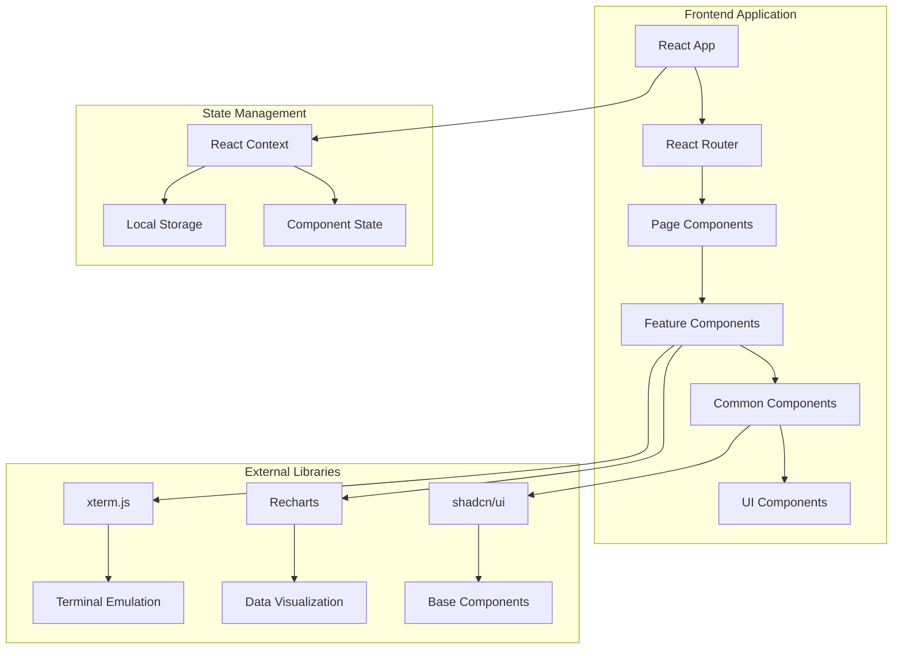
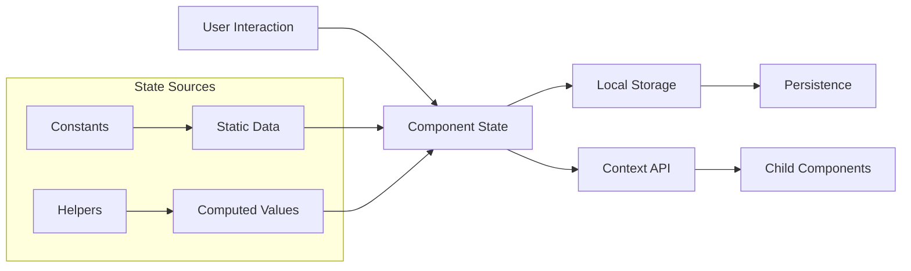

# Architecture Guide - Hack The World Platform

This document provides a comprehensive overview of the technical architecture, component relationships, data flow, and system design patterns used in the Hack The World cybersecurity learning platform.

## 🏗️ System Architecture Overview



## 📁 Directory Structure & Responsibilities

### Core Application Structure

```
src/
├── App.tsx                 # Main application component with routing
├── main.tsx               # Application entry point and React DOM rendering
├── index.css              # Global styles and Tailwind CSS imports
├── lib/                   # Core utilities and configurations
├── components/            # Reusable React components
├── pages/                 # Main application pages/routes
├── hooks/                 # Custom React hooks
└── assets/               # Static assets (images, icons, etc.)
```

### Library Structure (`src/lib/`)

The `lib` directory contains the core business logic and utilities:

```typescript
// lib/types.ts - Core data structures
interface Module {
  id: string;
  title: string;
  description: string;
  icon: LucideIcon;
  duration: string;
  difficulty: string;
  progress: number;
  // ... additional properties
}

interface Course {
  id: string;
  title: string;
  description: string;
  lessons: Lesson[] | number;
  labs: number;
  games: number;
  // ... additional properties
}

interface EnrolledCourse {
  title: string;
  sections: CourseSection[];
  labs: Lab[];
  games: Game[];
  resources: Resource[];
  // ... additional properties
}
```

**Key Files:**

- `types.ts` - TypeScript interfaces for all data structures
- `constants.ts` - Application constants (colors, navigation paths, etc.)
- `helpers.ts` - Utility functions for formatting, calculations
- `utils.ts` - General utilities (validation, localStorage, debounce)
- `index.ts` - Centralized exports for the library

## 🧩 Component Architecture

### Component Hierarchy

```
Pages (Route Components)
├── LandingPage
│   ├── HeroSection
│   ├── FeaturesSection
│   ├── InteractiveDemoSection
│   ├── CTASection
│   └── Footer
├── Dashboard
│   ├── DashboardHeader
│   ├── StatsGrid
│   └── DashboardTabs
│       ├── OverviewTab
│       ├── ProgressTab
│       └── AchievementsTab
├── CourseDetailPage
│   ├── CourseHero
│   ├── CourseFeatures
│   ├── CourseInfoSidebar
│   └── CourseTabsContainer
│       ├── OverviewTab
│       ├── CurriculumTab
│       ├── LabsTab
│       ├── GamesTab
│       └── AssetsTab
└── EnrolledCoursePage
    ├── CourseHeader
    ├── SplitView
    │   ├── VideoPlayer
    │   └── AIPlayground
    ├── ContentSidebar
    └── CourseTabs
```

### Component Categories

#### 1. **Common Components** (`/common`)

Shared UI components used across multiple pages:

```typescript
// DifficultyBadge.tsx
interface DifficultyBadgeProps {
  difficulty: string;
  className?: string;
}

// ProgressBar.tsx
interface ProgressBarProps {
  progress: number;
  showPercentage?: boolean;
  className?: string;
}

// StatCard.tsx
interface StatCardProps {
  title: string;
  value: string | number;
  icon: LucideIcon;
  color?: string;
}
```

#### 2. **Feature-Specific Components**

Components organized by application features:

- **`/course`** - Course detail and enrollment components
- **`/enrolled`** - Enrolled course learning interface
- **`/dashboard`** - User dashboard and progress tracking
- **`/landing`** - Marketing and landing page components
- **`/overview`** - Course overview and navigation
- **`/games`** - Interactive security games and challenges
- **`/terminal`** - Terminal emulation and command interfaces
- **`/effects`** - Animation and visual effects

#### 3. **UI Components** (`/ui`)

Base components from shadcn/ui library:

- Buttons, Cards, Dialogs, Forms
- Navigation, Tabs, Tooltips
- Data display components

## 🔄 Data Flow Architecture

### State Management Pattern



### Data Flow Examples

#### Course Enrollment Flow

```typescript
// 1. User clicks enroll button
const handleEnroll = (courseId: string) => {
  // 2. Update local storage
  const enrolledCourses = getEnrolledCourses();
  enrolledCourses.push(courseId);
  setEnrolledCourses(enrolledCourses);

  // 3. Navigate to enrolled course
  navigate(`/learn/${courseId}`);
};

// 4. Enrolled course page loads data
const EnrolledCoursePage = () => {
  const { courseId } = useParams();
  const courseData = getEnrolledCourseData(courseId);
  // ... render course content
};
```

#### Progress Tracking Flow

```typescript
// 1. Lesson completion
const markLessonComplete = (lessonId: string) => {
  // 2. Update lesson status
  updateLessonProgress(lessonId, true);

  // 3. Recalculate course progress
  const progress = calculateCourseProgress(courseId);

  // 4. Update UI components
  setProgress(progress);
};
```

## 🎮 Interactive Features Architecture

### Game System

```typescript
// Game component structure
interface GameProps {
  gameData: GameData;
  onComplete: (score: number) => void;
  onExit: () => void;
}

// Game types
type GameType = "cipher" | "hash-crack" | "port-scan" | "ctf";

// Game state management
interface GameState {
  currentGame: GameType | null;
  score: number;
  timeRemaining: number;
  isActive: boolean;
}
```

### Terminal System

```typescript
// Terminal component architecture
interface TerminalProps {
  commands: TerminalCommand[];
  onCommand: (command: string) => void;
  theme?: "matrix" | "classic" | "modern";
}

// Command processing
interface TerminalCommand {
  command: string;
  output: string;
  type: "success" | "error" | "info";
}
```

### AI Playground Architecture

```typescript
// AI Playground modes
type PlaygroundMode = "terminal" | "chat" | "analysis";

interface AIPlaygroundProps {
  mode: PlaygroundMode;
  onModeChange: (mode: PlaygroundMode) => void;
}

// Mode-specific components
const AIPlayground = ({ mode, onModeChange }) => {
  switch (mode) {
    case "terminal":
      return <AITerminal />;
    case "chat":
      return <AIChatInterface />;
    case "analysis":
      return <AIAnalysisTools />;
  }
};
```

## 🎨 Styling Architecture

### Design System

```typescript
// Color system (constants.ts)
export const COLORS = {
  primary: {
    green: "#00ff00",
    darkGreen: "#00cc00",
    lightGreen: "#33ff33",
  },
  difficulty: {
    beginner: "#4ade80",
    intermediate: "#fbbf24",
    advanced: "#f87171",
    expert: "#a855f7",
  },
  terminal: {
    background: "#0a0a0a",
    text: "#00ff00",
    border: "#333333",
  },
};

// Component styling patterns
const cardStyles = {
  base: "rounded-lg border bg-card text-card-foreground shadow-sm",
  interactive: "hover:shadow-lg transition-all duration-200",
  terminal: "bg-black border-green-500/30 text-green-400",
};
```

### Responsive Design

```css
/* Mobile-first approach */
.component {
  @apply w-full p-4;
}

/* Tablet */
@screen md {
  .component {
    @apply w-1/2 p-6;
  }
}

/* Desktop */
@screen lg {
  .component {
    @apply w-1/3 p-8;
  }
}
```

## 🔌 Integration Patterns

### Component Communication

#### Parent-Child Communication

```typescript
// Parent component
const ParentComponent = () => {
  const [data, setData] = useState();

  return <ChildComponent data={data} onUpdate={setData} />;
};

// Child component
interface ChildProps {
  data: any;
  onUpdate: (data: any) => void;
}
```

#### Sibling Communication via Parent

```typescript
const ParentContainer = () => {
  const [sharedState, setSharedState] = useState();

  return (
    <>
      <ComponentA state={sharedState} onStateChange={setSharedState} />
      <ComponentB state={sharedState} onStateChange={setSharedState} />
    </>
  );
};
```

### Custom Hooks Pattern

```typescript
// useLocalStorage hook
const useLocalStorage = <T>(key: string, initialValue: T) => {
  const [storedValue, setStoredValue] = useState<T>(() => {
    try {
      const item = window.localStorage.getItem(key);
      return item ? JSON.parse(item) : initialValue;
    } catch (error) {
      return initialValue;
    }
  });

  const setValue = (value: T | ((val: T) => T)) => {
    try {
      const valueToStore =
        value instanceof Function ? value(storedValue) : value;
      setStoredValue(valueToStore);
      window.localStorage.setItem(key, JSON.stringify(valueToStore));
    } catch (error) {
      console.error(error);
    }
  };

  return [storedValue, setValue] as const;
};

// Usage in components
const useEnrolledCourses = () => {
  return useLocalStorage<string[]>("enrolledCourses", []);
};
```

## 🚀 Performance Optimizations

### Component Optimization

```typescript
// Memoization for expensive calculations
const ExpensiveComponent = memo(({ data }) => {
  const processedData = useMemo(() => {
    return expensiveCalculation(data);
  }, [data]);

  return <div>{processedData}</div>;
});

// Callback optimization
const ParentComponent = () => {
  const handleClick = useCallback((id: string) => {
    // Handle click logic
  }, []);

  return <ChildComponent onClick={handleClick} />;
};
```

### Bundle Optimization

```typescript
// Lazy loading for pages
const LazyDashboard = lazy(() => import("./pages/Dashboard"));
const LazyCoursePage = lazy(() => import("./pages/CourseDetailPage"));

// Route-based code splitting
const App = () => (
  <Suspense fallback={<LoadingSpinner />}>
    <Routes>
      <Route path="/dashboard" element={<LazyDashboard />} />
      <Route path="/course/:id" element={<LazyCoursePage />} />
    </Routes>
  </Suspense>
);
```

## 🔒 Security Considerations

### Input Validation

```typescript
// Zod schemas for validation
const courseSchema = z.object({
  id: z.string().min(1),
  title: z.string().min(1).max(100),
  difficulty: z.enum(["beginner", "intermediate", "advanced", "expert"]),
});

// Form validation
const CourseForm = () => {
  const form = useForm({
    resolver: zodResolver(courseSchema),
  });

  // ... form implementation
};
```

### Safe Data Handling

```typescript
// Safe localStorage access
const safeGetItem = (key: string) => {
  try {
    return JSON.parse(localStorage.getItem(key) || "null");
  } catch {
    return null;
  }
};

// XSS prevention in terminal output
const sanitizeOutput = (output: string) => {
  return output.replace(
    /<script\b[^<]*(?:(?!<\/script>)<[^<]*)*<\/script>/gi,
    ""
  );
};
```

## 🧪 Testing Architecture

### Component Testing Strategy

```typescript
// Component test example
describe("DifficultyBadge", () => {
  it("renders correct difficulty level", () => {
    render(<DifficultyBadge difficulty="advanced" />);
    expect(screen.getByText("Advanced")).toBeInTheDocument();
  });

  it("applies correct styling for difficulty", () => {
    render(<DifficultyBadge difficulty="expert" />);
    const badge = screen.getByText("Expert");
    expect(badge).toHaveClass("bg-purple-500");
  });
});
```

### Integration Testing

```typescript
// Page integration test
describe("CourseDetailPage", () => {
  it("displays course information correctly", () => {
    const mockCourse = createMockCourse();
    render(<CourseDetailPage course={mockCourse} />);

    expect(screen.getByText(mockCourse.title)).toBeInTheDocument();
    expect(screen.getByText(mockCourse.description)).toBeInTheDocument();
  });
});
```

## 📊 Monitoring & Analytics

### Performance Monitoring

```typescript
// Performance tracking
const usePerformanceMonitor = (componentName: string) => {
  useEffect(() => {
    const startTime = performance.now();

    return () => {
      const endTime = performance.now();
      console.log(`${componentName} render time: ${endTime - startTime}ms`);
    };
  }, [componentName]);
};
```

### User Analytics

```typescript
// User interaction tracking
const trackUserAction = (action: string, data?: any) => {
  // Analytics implementation
  console.log("User action:", action, data);
};

// Usage in components
const handleCourseEnroll = (courseId: string) => {
  trackUserAction("course_enroll", { courseId });
  // ... enrollment logic
};
```

## 🔄 Development Workflow

### Component Development Process

1. **Design Phase**

   - Define component interface
   - Create TypeScript interfaces
   - Plan component hierarchy

2. **Implementation Phase**

   - Create functional component
   - Implement props interface
   - Add styling with Tailwind CSS

3. **Integration Phase**

   - Export from index.ts
   - Update parent components
   - Test component integration

4. **Documentation Phase**
   - Add JSDoc comments
   - Update README files
   - Create usage examples

### Code Quality Standards

```typescript
// Component template
interface ComponentProps {
  // Required props
  title: string;
  data: DataType;

  // Optional props
  className?: string;
  onAction?: (data: DataType) => void;
}

/**
 * Component description
 * @param props - Component props
 * @returns JSX element
 */
const Component: React.FC<ComponentProps> = ({
  title,
  data,
  className = "",
  onAction,
}) => {
  // Component implementation
  return (
    <div className={cn("base-styles", className)}>
      {/* Component content */}
    </div>
  );
};

export default Component;
```

## 🚀 Deployment Architecture

### Build Process

```bash
# Development build
pnpm dev          # Vite dev server with HMR

# Production build
pnpm build        # TypeScript compilation + Vite build
pnpm preview      # Preview production build locally
```

### Environment Configuration

```typescript
// Environment variables
interface Config {
  NODE_ENV: "development" | "production";
  API_BASE_URL: string;
  ENABLE_ANALYTICS: boolean;
}

const config: Config = {
  NODE_ENV: import.meta.env.NODE_ENV,
  API_BASE_URL: import.meta.env.VITE_API_BASE_URL || "",
  ENABLE_ANALYTICS: import.meta.env.VITE_ENABLE_ANALYTICS === "true",
};
```

## 📈 Scalability Considerations

### Component Scalability

- **Modular Architecture**: Components are designed for reusability
- **Lazy Loading**: Route-based code splitting reduces initial bundle size
- **Tree Shaking**: Unused code is eliminated during build
- **Component Libraries**: Shared components reduce duplication

### Performance Scalability

- **Virtual Scrolling**: For large lists (course catalogs, etc.)
- **Memoization**: Expensive calculations are cached
- **Debouncing**: User input is debounced to reduce API calls
- **Image Optimization**: Lazy loading and responsive images

## 📋 Component Reference

### Quick Component Lookup

#### Common Components (`/common`)

- **`DifficultyBadge`** - Color-coded difficulty level indicators
- **`ProgressBar`** - Animated progress indicators with optional percentage
- **`StatCard`** - Statistics display cards with icons and trend indicators

#### Effects Components (`/effects`)

- **`TypewriterText`** - Animated typewriter text effect
- **`MatrixRain`** - Matrix-style digital rain background effect

#### Game Components (`/games`)

- **`CipherGame`** - Caesar cipher decoding challenge
- **`HashCrackGame`** - MD5 hash cracking challenge
- **`PortScanGame`** - Network port scanning simulation
- **`GameSelector`** - Game selection and scoring container

#### Terminal Components (`/terminal`)

- **`TerminalWindow`** - Base terminal with macOS-style controls
- **`LiveTerminal`** - Animated terminal with live command execution

#### Landing Components (`/landing`)

- **`HeroSection`** - Main hero area with typewriter and terminal demo
- **`FeaturesSection`** - Training modules showcase
- **`InteractiveDemoSection`** - Live cyber range demonstration
- **`CTASection`** - Call-to-action section
- **`Footer`** - Site footer with branding

#### Course Components (`/course`)

- **`CourseHero`** - Course header with title, rating, and skills
- **`CourseTabsContainer`** - Tabbed interface for course information
- **`EnrollmentButton`** - Course enrollment with terminal styling

#### Enrolled Course Components (`/enrolled`)

- **`VideoPlayer`** - Video playback with lesson navigation
- **`AIPlayground`** - AI assistant with multiple interaction modes
- **`SplitView`** - Resizable layout manager
- **`ContentSidebar`** - Course content navigation

#### Dashboard Components (`/dashboard`)

- **`DashboardTabs`** - Main tabs for overview, progress, achievements
- **`CourseTree`** - Hierarchical course structure display
- **`StatsGrid`** - Statistics cards display
- **`ModuleProgressCard`** - Individual module progress tracking

### Component Usage Examples

#### Basic Usage

```typescript
import { DifficultyBadge, ProgressBar, StatCard } from "@/components/common";
import { TypewriterText } from "@/components/effects";

const ExamplePage = () => (
  <div className="space-y-6">
    <TypewriterText text="Welcome to Cybersecurity Training" />
    <div className="grid grid-cols-3 gap-4">
      <StatCard title="Courses" value={12} icon={BookOpen} />
      <StatCard title="Progress" value="75%" icon={TrendingUp} />
      <StatCard title="Points" value={1250} icon={Award} />
    </div>
    <div className="flex items-center gap-4">
      <DifficultyBadge difficulty="intermediate" />
      <ProgressBar progress={65} showPercentage />
    </div>
  </div>
);
```

#### Advanced Composition

```typescript
import { SplitView, VideoPlayer, AIPlayground } from "@/components/enrolled";
import { TerminalWindow } from "@/components/terminal";

const LearningInterface = () => {
  const [currentLesson, setCurrentLesson] = useState();
  const [aiMode, setAiMode] = useState("chat");

  return (
    <SplitView
      leftPanel={
        <VideoPlayer
          lesson={currentLesson}
          onComplete={() => markLessonComplete(currentLesson.id)}
          onNext={() => goToNextLesson()}
        />
      }
      rightPanel={
        <TerminalWindow title="AI Assistant">
          <AIPlayground
            mode={aiMode}
            onModeChange={setAiMode}
            context={currentLesson?.content}
          />
        </TerminalWindow>
      }
      defaultSplit={60}
    />
  );
};
```

---

This architecture guide provides a comprehensive overview of how the Hack The World platform is structured and how its components work together. For getting started and project overview, refer to the main [README.md](./README.md).
