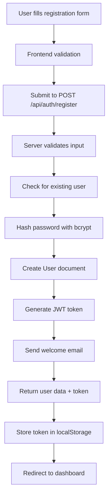
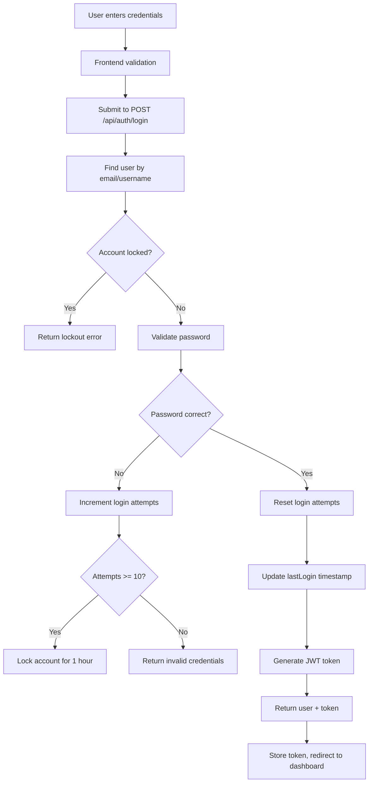
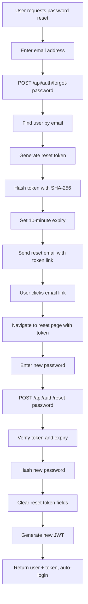
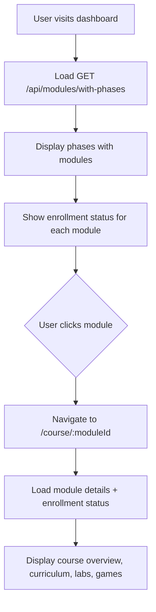
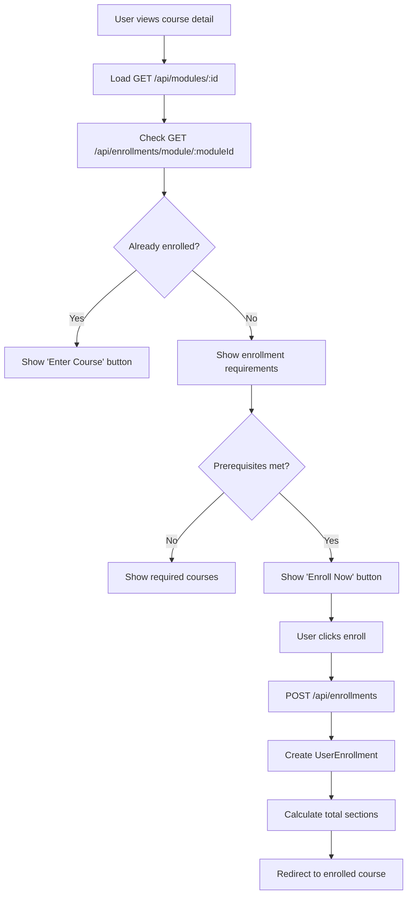
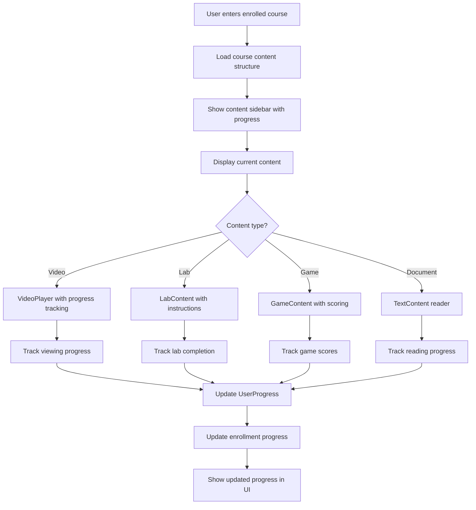
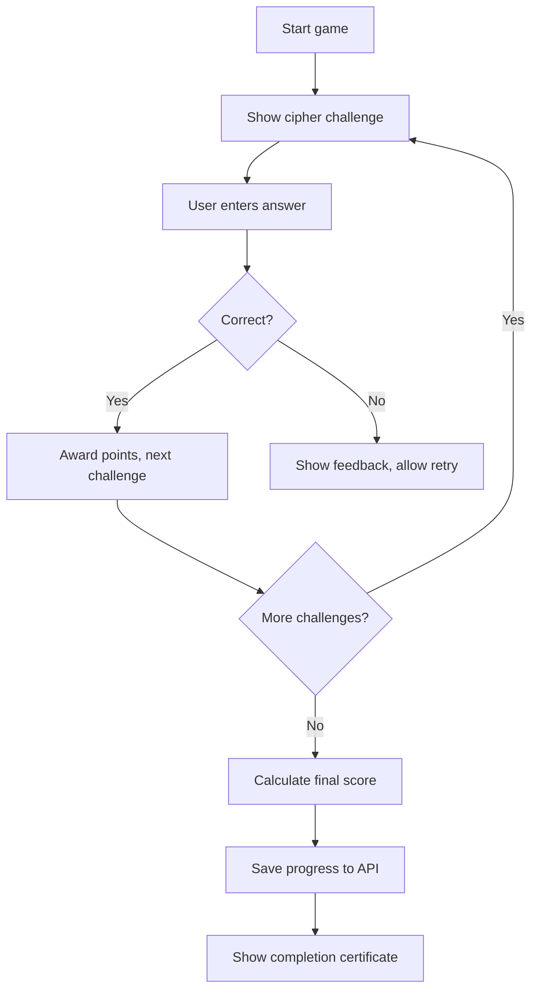
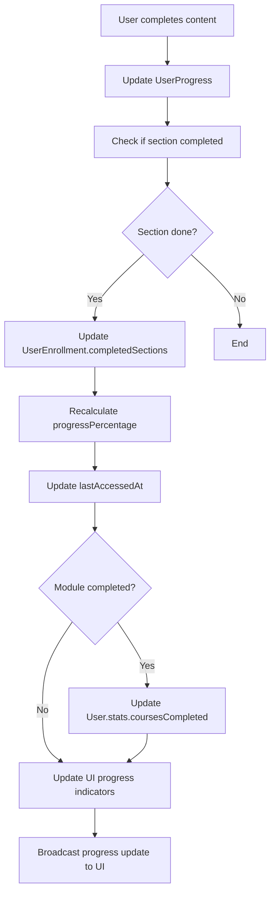

# Hack The World - Features & Workflows Reference

## 🎯 Complete Features Overview

**This document maps every feature, how it works, and the complete workflow for LLM understanding and development.**

---

## 🔐 Authentication & User Management System

### Registration Workflow
**Files**: `frontend/src/pages/SignupPage.tsx`, `server/src/controllers/authController.js`



**Key Features**:
- **Username uniqueness**: Lowercase, alphanumeric + _ -, 3-30 chars
- **Email validation**: Standard email format, stored lowercase
- **Password complexity**: 8+ chars, uppercase, lowercase, number, special char
- **Experience level selection**: Beginner, Intermediate, Advanced, Expert
- **Automatic profile setup**: Auto-generate displayName, initialize stats
- **Welcome email**: Sent via EmailService with template

**Implementation Details**:
```typescript
// Frontend validation (SignupPage.tsx)
const validationSchema = {
  username: /^[a-z0-9_-]{3,30}$/,
  email: /^[^\s@]+@[^\s@]+\.[^\s@]+$/,
  password: /^(?=.*[a-z])(?=.*[A-Z])(?=.*\d)(?=.*[@$!%*?&])[A-Za-z\d@$!%*?&]{8,}$/
};

// Backend password hashing (User.js pre-save middleware)
userSchema.pre('save', async function(next) {
  if (!this.isModified('password')) return next();
  this.password = await bcrypt.hash(this.password, 12);
  next();
});
```

### Login Workflow
**Files**: `frontend/src/pages/LoginPage.tsx`, `server/src/controllers/authController.js`



**Security Features**:
- **Account lockout**: 10 failed attempts = 1 hour lock
- **Flexible login**: Accept email OR username
- **Login tracking**: Update lastLogin timestamp
- **Token invalidation**: If password changed after token issue

### Password Reset Workflow
**Files**: `frontend/src/pages/ForgotPasswordPage.tsx`, `frontend/src/pages/ResetPasswordPage.tsx`



**Security Features**:
- **Crypto-secure tokens**: `crypto.randomBytes(32)`
- **Short expiry**: 10 minutes from generation
- **Token hashing**: SHA-256 hash stored in database
- **One-time use**: Token cleared after successful reset

---

## 📚 Course Management System

### Course Discovery Workflow
**Files**: `frontend/src/pages/Dashboard.tsx`, `frontend/src/components/dashboard/`



**Features**:
- **Phase-based organization**: Courses grouped by learning phases
- **Progress indicators**: Show completion status for enrolled courses
- **Filtering**: By difficulty, phase, enrollment status
- **Prerequisites display**: Show required courses
- **Quick enrollment**: One-click enrollment from cards

### Course Detail & Enrollment Workflow
**Files**: `frontend/src/pages/CourseDetailPage.tsx`, `frontend/src/components/course/`



**Course Detail Features**:
- **Tabbed interface**: Overview, Curriculum, Labs, Games, Assets
- **Content preview**: Show what's included in the course
- **Duration estimation**: Total estimated hours
- **Difficulty indication**: Color-coded difficulty levels
- **Topic tags**: Relevant cybersecurity topics covered
- **Learning outcomes**: What students will learn

### Enrolled Course Experience
**Files**: `frontend/src/pages/EnrolledCoursePage.tsx`, `frontend/src/components/enrolled/`



**Content Player Features**:
- **Unified interface**: All content types in same player
- **Progress sidebar**: Navigation with completion indicators
- **Auto-progression**: Option to auto-advance to next content
- **Bookmarking**: Save position in videos and documents
- **Note-taking**: Integrated note system (planned)
- **Resource access**: Links, downloads, references

---

## 🎮 Interactive Learning Features

### Video Learning System
**Files**: `frontend/src/components/enrolled/VideoPlayer.tsx`

**Features**:
- **Progress tracking**: Real-time progress updates every 10% or 30 seconds
- **Auto-completion**: Mark complete at 90% viewing
- **Playback controls**: Speed control, quality selection
- **Transcript support**: Closed captions and searchable transcripts
- **Bookmarks**: Save important moments
- **Resume playback**: Continue from last position

**Implementation**:
```typescript
const handleTimeUpdate = useCallback((currentTime: number, duration: number) => {
  const percentage = (currentTime / duration) * 100;
  
  // Update progress periodically
  if (shouldUpdateProgress(percentage, lastUpdatePercentage)) {
    updateContentProgress({ 
      contentId: content.id, 
      progressPercentage: percentage 
    });
  }
  
  // Auto-complete at 90%
  if (percentage >= 90 && !content.isCompleted) {
    markContentComplete({ contentId: content.id });
  }
}, [content.id, lastUpdatePercentage]);
```

### Interactive Game System
**Files**: `frontend/src/components/games/`

#### Cipher Game
**Purpose**: Cryptography and encoding challenges
**Features**:
- **Multiple cipher types**: Caesar, Base64, ROT13, Atbash, etc.
- **Progressive difficulty**: Start simple, increase complexity
- **Time limits**: Encourage quick thinking
- **Hint system**: Graduated hints to help struggling users
- **Scoring**: Points based on speed and hints used

**Implementation Flow**:


#### Hash Cracking Game
**Purpose**: Password security and hash functions
**Features**:
- **Multiple hash types**: MD5, SHA-1, SHA-256
- **Dictionary attacks**: Pre-loaded wordlists
- **Brute force simulation**: Show computational complexity
- **Time tracking**: Measure cracking time
- **Educational content**: Explain hash weaknesses

#### Port Scanning Game
**Purpose**: Network reconnaissance and security
**Features**:
- **Simulated networks**: Pre-configured target systems
- **Tool selection**: Different scanning techniques
- **Service identification**: Identify running services
- **Vulnerability discovery**: Find security weaknesses
- **Report generation**: Professional security reports

### Lab Environment System
**Files**: `frontend/src/components/terminal/`, `frontend/src/pages/*Lab.tsx`

#### Terminal Labs
**Features**:
- **Full terminal emulation**: Bash-like interface
- **Pre-configured environments**: Ready-to-use lab setups
- **Command validation**: Check if correct commands used
- **File system simulation**: Virtual file operations
- **Progress tracking**: Monitor lab completion steps

**Terminal Implementation**:
```typescript
const TerminalWindow = ({ labConfig }: TerminalProps) => {
  const [history, setHistory] = useState<string[]>([]);
  const [fileSystem, setFileSystem] = useState(labConfig.initialFileSystem);
  const [currentDirectory, setCurrentDirectory] = useState('/home/user');
  
  const executeCommand = async (command: string) => {
    // Parse command and arguments
    const [cmd, ...args] = command.split(' ');
    
    // Execute based on command type
    switch (cmd) {
      case 'ls':
        return listDirectory(currentDirectory, fileSystem);
      case 'cd':
        return changeDirectory(args[0], currentDirectory, setCurrentDirectory);
      case 'cat':
        return readFile(args[0], currentDirectory, fileSystem);
      case 'grep':
        return grepSearch(args, currentDirectory, fileSystem);
      // ... more commands
    }
    
    // Check if command completes lab objective
    if (labConfig.completionCommands.includes(command)) {
      await markContentComplete({ contentId: labConfig.contentId });
    }
  };
};
```

#### Web Security Labs
**Files**: `frontend/src/pages/WebSecLab.tsx`
**Features**:
- **Vulnerable web applications**: Simulated security flaws
- **XSS challenges**: Cross-site scripting examples
- **SQL injection**: Database attack simulations
- **Authentication bypass**: Session and token vulnerabilities
- **Tool integration**: Browser dev tools, Burp Suite guidance

#### Social Engineering Labs
**Files**: `frontend/src/pages/SocialEngLab.tsx`
**Features**:
- **Phishing simulations**: Email and website examples
- **Social media OSINT**: Information gathering exercises
- **Pretexting scenarios**: Phone and in-person techniques
- **Awareness training**: Recognition and prevention
- **Real-world examples**: Case studies and analysis

---

## 📊 Progress Tracking & Analytics

### Multi-Level Progress System

#### Content-Level Progress
**Model**: `UserProgress` (server/src/models/UserProgress.js)
**Tracking**:
- **Video progress**: Percentage watched, auto-complete at 90%
- **Lab progress**: Completion steps, time spent, success rate
- **Game progress**: Score, completion time, attempts
- **Document progress**: Reading time, sections completed

#### Module-Level Progress
**Model**: `UserEnrollment` (server/src/models/UserEnrollment.js)
**Calculation**:
```javascript
// Automatic calculation based on content completion
const calculateModuleProgress = (completedContent, totalContent) => {
  const completedSections = countCompletedSections(completedContent);
  const totalSections = countTotalSections(totalContent);
  return Math.round((completedSections / totalSections) * 100);
};
```

#### User-Level Statistics
**Model**: `User.stats` (server/src/models/User.js)
**Metrics**:
- **Total points**: Accumulated from games and assessments
- **Level**: Calculated from total points (1-100 scale)
- **Courses completed**: Number of modules finished
- **Labs completed**: Hands-on exercises finished
- **Games completed**: Interactive challenges finished
- **Achievements earned**: Special accomplishments

### Progress Synchronization Workflow


### Analytics Dashboard
**Files**: `frontend/src/components/dashboard/ProgressTab.tsx`, `admin/src/components/Dashboard.jsx`

**Student Analytics**:
- **Learning streaks**: Consecutive days of activity
- **Time spent**: Daily, weekly, monthly learning time
- **Completion rates**: Success rate across different content types
- **Skill progression**: Progress in different cybersecurity domains
- **Achievements**: Badges and milestones earned

**Admin Analytics**:
- **Enrollment statistics**: Course popularity, completion rates
- **Content performance**: Which materials are most effective
- **User engagement**: Activity patterns, drop-off points
- **Learning paths**: How users progress through content
- **Assessment results**: Score distributions, difficulty analysis

---

## 🛡️ Security Features

### Account Security
**Files**: `server/src/models/User.js`, `server/src/middleware/auth.js`

**Password Security**:
- **Complexity requirements**: 8+ chars, mixed case, numbers, symbols
- **Bcrypt hashing**: Salt rounds 12 for strong protection
- **Password change tracking**: `passwordChangedAt` timestamp
- **Token invalidation**: Old JWTs invalid after password change

**Account Protection**:
- **Login attempt limiting**: Max 10 attempts before lockout
- **Account lockout**: 1-hour lockout after failed attempts
- **Session management**: JWT tokens with 7-day expiry
- **Password reset tokens**: Crypto-secure, 10-minute expiry

### API Security
**Files**: `server/index.js`, `server/src/middleware/`

**Request Protection**:
- **Rate limiting**: 10,000 requests per 15 minutes
- **CORS configuration**: Specific origins allowed
- **Helmet.js**: Security headers for XSS, CSRF protection
- **Input validation**: express-validator for all inputs
- **SQL injection prevention**: Mongoose ODM protection

**Authentication & Authorization**:
- **JWT validation**: Every protected route verified
- **Role-based access**: Student vs Admin permissions
- **Admin approval**: Admin accounts require activation
- **Token refresh**: Automatic token renewal (planned)

### Data Privacy
**Implementation**: Throughout models and controllers

**User Data Protection**:
- **Password exclusion**: Never return password in API responses
- **Sensitive field protection**: Security fields excluded from client
- **Data minimization**: Only required fields collected
- **Soft deletion**: Preserve data integrity, allow recovery

---

## 🔄 Data Flow & State Management

### Frontend State Architecture
**Files**: `frontend/src/app/store.ts`, `frontend/src/features/`

```typescript
// Redux Toolkit store structure
export const store = configureStore({
  reducer: {
    auth: authSlice.reducer,        // User authentication state
    api: apiSlice.reducer,          // RTK Query cache and loading states
  },
  middleware: (getDefaultMiddleware) =>
    getDefaultMiddleware().concat(apiSlice.middleware),
});

// RTK Query provides:
// - Automatic caching with intelligent invalidation
// - Loading states for all API calls
// - Error handling and retry logic
// - Optimistic updates for better UX
// - Background refetching for fresh data
```

### Cache Management Strategy
**Implementation**: RTK Query tag-based invalidation

```typescript
// Tag system for cache invalidation
tagTypes: ['User', 'Phase', 'Module', 'Content', 'Enrollment', 'Progress'],

// Example: Content update invalidates related caches
updateContent: builder.mutation({
  query: ({ id, ...data }) => ({
    url: `/content/${id}`,
    method: 'PUT',
    body: data,
  }),
  invalidatesTags: (result, error, { id }) => [
    { type: 'Content', id },
    { type: 'Module', id: result?.moduleId },
  ],
}),
```

### Real-time Updates
**Implementation**: Optimistic updates and automatic refetching

```typescript
// Optimistic progress updates
const [updateProgress] = useUpdateContentProgressMutation();

const handleProgressUpdate = async (contentId: string, progress: number) => {
  // Immediately update UI
  dispatch(apiSlice.util.updateQueryData('getContentProgress', contentId, (draft) => {
    draft.progressPercentage = progress;
  }));
  
  try {
    // Sync with server
    await updateProgress({ contentId, progressPercentage: progress });
  } catch (error) {
    // Revert on error
    dispatch(apiSlice.util.invalidateTags(['Progress']));
  }
};
```

---

## 🚀 Development Workflows

### Adding New Content Type
**Steps**: Database → API → Frontend components

1. **Update Content Model** (`server/src/models/Content.js`)
   ```javascript
   // Add new content type to enum
   type: {
     type: String,
     enum: ['video', 'lab', 'game', 'document', 'quiz'], // Add 'quiz'
     required: true
   }
   ```

2. **Add Controller Methods** (`server/src/controllers/contentController.js`)
   ```javascript
   // Add quiz-specific validation and handling
   const createQuizContent = async (req, res, next) => {
     // Quiz-specific logic
   };
   ```

3. **Update Frontend Types** (`frontend/src/lib/types.ts`)
   ```typescript
   export type ContentType = 'video' | 'lab' | 'game' | 'document' | 'quiz';
   ```

4. **Create Component** (`frontend/src/components/enrolled/QuizContent.tsx`)
   ```typescript
   export const QuizContent = ({ content }: QuizContentProps) => {
     // Quiz player implementation
   };
   ```

5. **Update Content Router** (`frontend/src/components/enrolled/ContentContainer.tsx`)
   ```typescript
   // Add quiz case to content type switching
   case 'quiz':
     return <QuizContent content={content} />;
   ```

### Adding New API Endpoint
**Steps**: Route → Validation → Controller → Frontend

1. **Define Route** (`server/src/routes/`)
   ```javascript
   router.get('/stats/:userId', protect, getUserStats);
   ```

2. **Add Validation** (`server/src/middleware/validation/`)
   ```javascript
   const getUserStatsValidation = [
     param('userId').isMongoId().withMessage('Invalid user ID'),
   ];
   ```

3. **Create Controller** (`server/src/controllers/`)
   ```javascript
   const getUserStats = async (req, res, next) => {
     // Implementation
   };
   ```

4. **Add to RTK Query** (`frontend/src/features/api/apiSlice.ts`)
   ```typescript
   getUserStats: builder.query<UserStats, string>({
     query: (userId) => `/stats/${userId}`,
     providesTags: ['User'],
   }),
   ```

5. **Use in Component**
   ```typescript
   const { data: stats } = useGetUserStatsQuery(userId);
   ```

### Testing Workflow
**Files**: `*/__tests__/`, `*.test.js`, `*.test.tsx`

**Backend Testing**:
```bash
# Run all server tests
npm test

# Run specific test file
npm test auth.test.js

# Watch mode for development
npm run test:watch
```

**Frontend Testing**:
```bash
# Run all frontend tests
npm run test

# Run with coverage
npm run test:coverage

# Watch mode
npm run test:watch
```

**Test Structure**:
```typescript
// Component test example
describe('VideoPlayer', () => {
  it('should track progress updates', async () => {
    const mockUpdateProgress = jest.fn();
    render(<VideoPlayer content={mockContent} onProgressUpdate={mockUpdateProgress} />);
    
    // Simulate video progress
    fireEvent.timeUpdate(screen.getByRole('video'), { currentTime: 30, duration: 100 });
    
    expect(mockUpdateProgress).toHaveBeenCalledWith(30);
  });
});
```

---

## 🎯 Feature Roadmap & Extension Points

### Planned Features
- **Real-time collaboration**: Shared lab environments
- **Mentor system**: Expert guidance and Q&A
- **Competition platform**: Cybersecurity CTF events
- **Certification paths**: Industry-recognized credentials
- **Mobile app**: Native iOS/Android applications
- **Advanced analytics**: ML-powered learning insights

### Extension Points
- **Plugin system**: Third-party content integration
- **Custom lab environments**: Docker-based sandboxes
- **Assessment engine**: Automated testing and grading
- **Learning paths**: Personalized curriculum recommendations
- **Integration APIs**: Connect with external security tools

## 🎨 UI Design Patterns & Enhancements

### Retro Cybersecurity Design System
**Files**: `frontend/src/components/dashboard/`, `frontend/src/pages/Dashboard.tsx`

**Design Philosophy**: CyberSecOverview-inspired terminal aesthetic with matrix/hacker theme

#### Core Design Elements

**Terminal Interface Patterns**:
```css
/* Terminal header paths */
.terminal-path {
  font-family: mono;
  color: text-green-400;
  format: ~/section/subsection/
}

/* Scanline effects */
.scanlines {
  background: linear-gradient(transparent, rgba(green, 0.2), transparent);
  background-size: 100% 4px;
  animation: pulse;
  opacity: 0.1;
}

/* Glitch border animations */
.glitch-border:hover {
  background: linear-gradient(from-color/0 via-color/20 to-color/0);
  opacity: 0-100 transition;
}
```

**Tree Structure Components**:
- **Characters**: `├──` (branch), `└──` (last item)
- **Vertical lines**: `w-px h-20 bg-green-400/30`
- **Usage**: Module timelines, file system navigation

**Color System**:
- **Primary**: Green matrix theme (`text-green-400`, `border-green-400/30`)
- **Discovery**: Cyan accents (`text-cyan-400`) for course discovery
- **Phase-based**: Green (beginner), Yellow (intermediate), Red (advanced)
- **Background**: `bg-black/60`, `bg-gradient-to-br from-gray-900/80 to-black/80`

#### Enhanced Dashboard Components

**LearningDashboard.tsx**:
- Retro progress cards with hover animations
- Terminal command simulation
- Real-time data integration with API
- Circular progress with cyberpunk styling

**EnhancedProgressTab.tsx**:
- Tree-structured module timeline
- Interactive phase filtering
- Enhanced course discovery section
- Terminal file system aesthetic

**Course Discovery Section**:
- Cyber-themed course cards with retro styling
- Difficulty-based filtering with neon borders
- Only shows non-enrolled courses
- Enhanced grid layout with hover effects

### Loading State Management System
**Files**: `frontend/src/pages/EnrolledCoursePage.tsx`

#### Problem Solved
**Issue**: Loading overlay cleared based on API completion, but content rendering took additional time, causing visible content updates after loading disappeared.

#### Solution Implementation

**Content Rendering Tracking**:
```typescript
const [isContentRendering, setIsContentRendering] = useState(false);

// Track content rendering completion
useEffect(() => {
  if (currentContentData?.success && courseData) {
    setIsContentRendering(true);
    
    const frameId = requestAnimationFrame(() => {
      setTimeout(() => {
        setIsContentRendering(false);
      }, 100);
    });
    
    return () => cancelAnimationFrame(frameId);
  }
}, [currentContentData, courseData, currentContentId]);
```

**Enhanced Loading States**:
- `isNavigating`: Navigation between content
- `isCompleting`: Marking content complete
- `isAutoCompleting`: Auto-completion of videos
- `isContentRendering`: Content render completion

**Loading Logic**:
```typescript
const isActionLoading = isNavigating || isCompleting || isAutoCompleting || isContentRendering;

// Clear loading only when both API and rendering complete
useEffect(() => {
  if (!currentContentLoading && courseData && !isContentRendering && 
      (isNavigating || isCompleting || isAutoCompleting)) {
    setTimeout(() => {
      // Clear all loading states
    }, 200);
  }
}, [currentContentLoading, courseData, isContentRendering, ...]);
```

**Benefits**:
- Loading overlay persists until content fully rendered
- Smooth user experience without content flashing
- Accurate loading state representation
- Enhanced loading messages with context

### Implementation Guidelines

**When to Use Retro Styling**:
- Dashboard and overview interfaces
- Terminal-based components
- Cybersecurity-themed sections

**Color Guidelines**:
- Green: Primary interface, enrolled content
- Cyan: Discovery, available content
- Yellow: In-progress, intermediate
- Red: Advanced, alerts
- Orange: Streaks, achievements

**Animation Patterns**:
- `animate-pulse`: Scanlines, status indicators
- `animate-spin`: Loading icons, activity indicators
- `animate-bounce`: Interactive elements
- `transition-all duration-300`: Standard hover effects

This comprehensive features and workflows documentation provides complete understanding of every system component, enabling rapid development and extension of the Hack The World platform.